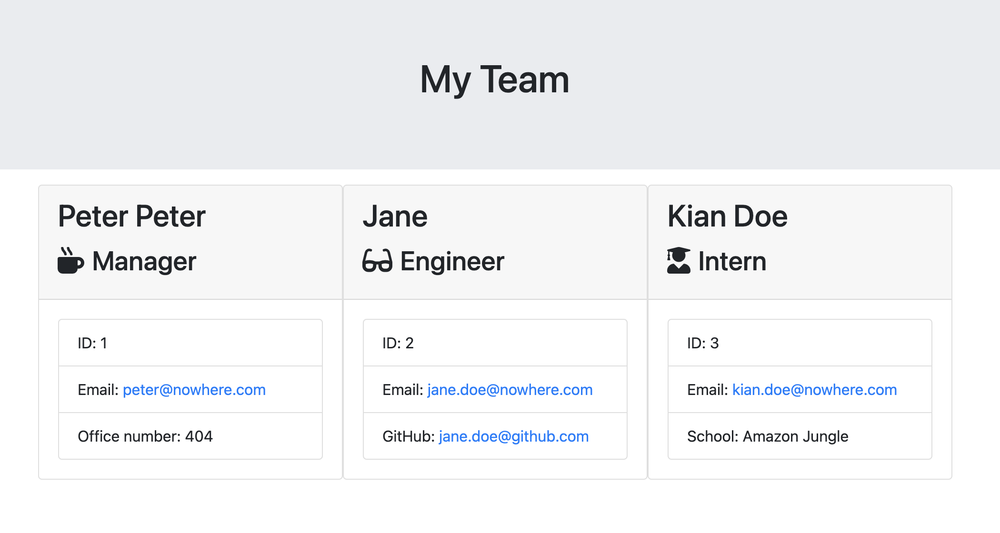

# Team Profile Generator

### Description 
An application that takes in user's input and generate a team profile in html

### Installation 
1. Use `npm i inquirer` and `npm i jest` in order to use the application
2. Run `node index` in terminal and answer all the questions
3. Go to `__tests__` directory and run `npm run test` to check passing tests

### Screenshot of webpage 

### Usage and demo
